# Naim

<p align="center">
  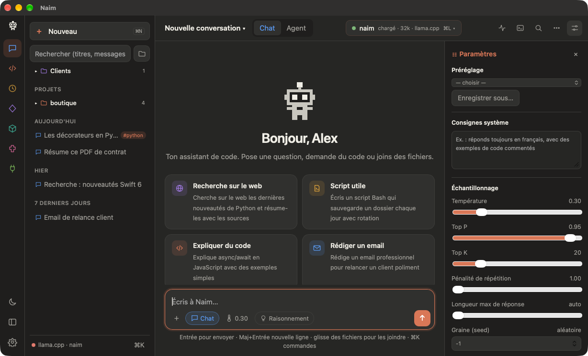
</p>

<p align="center">
  <a href="LICENSE"></a>
  
  
  
</p>

**Naim** est un assistant de code autonome qui tourne **entièrement sur ton Mac** : aucun compte, aucun abonnement,
aucune donnée envoyée ailleurs. Il discute, cherche sur le web, et surtout **agit** : il crée, modifie, lance et vérifie
tes projets tout seul.

Créé par **ABDESSEMED Mohamed**. Modèle : **Naim 9B** (successeur de Mimo), fourni avec l'application.

### Installation rapide

Sur un Mac Apple Silicon, dans le Terminal :

```bash
curl -fsSL https://raw.githubusercontent.com/nebios7/naim/main/install.sh | bash
```

C'est tout : l'installeur télécharge Naim, vérifie le Mac, installe le moteur et propose le modèle. Relancer la même
commande met Naim à jour. Détails dans [Installation](#installation).

## Ce que Naim sait faire

- **Chat** : réponses, explications, recherche web avec sources, pièces jointes (PDF même scannés, Word, Excel,
  PowerPoint, images, code).
- **Agent** : travaille dans ton dossier de projet — fichiers, commandes, serveurs en arrière-plan, liste de tâches,
  vérification automatique des apps web, points d'annulation, git et pull requests GitHub. Il teste tes apps web dans
  un **vrai navigateur** (formulaires, clics, erreurs JavaScript), lit plusieurs fichiers **en parallèle**, te pose une
  **question à choix** quand c'est ambigu, et tient un **carnet de tâche** pour reprendre là où il s'est arrêté.
- **Tu le guides pendant qu'il travaille** : écris-lui une consigne en cours de tâche, il en tient compte à l'étape
  suivante sans s'arrêter. Une barre montre l'étape et le temps écoulé ; l'onglet **Modifs** liste chaque fichier
  changé avec ses différences, et chacun s'annule en un clic.
- **Livrables** : de vrais fichiers, vérifiés avant d'être rendus — **PDF** soignés (CV, lettre, rapport, facture),
  **Word, Excel, PowerPoint**, **schémas** (architecture, flux, séquence, base de données, Gantt, carte mentale) en
  PNG / SVG / PDF, **visuels** (logo, bannière, affiche). Naim **regarde** chaque fichier (il voit l'image) et corrige
  ce qui déborde ; les fichiers apparaissent en **cartes** avec aperçu, prêts à ouvrir ou envoyer par mail.
  Un document fait à partir des tiens (CV, lettre) est **comparé à l'original** : rien d'inventé.
- **Recherche approfondie** : 10 à 20 sources recoupées, rapport avec citations.
- **Apps iOS** : crée une app SwiftUI, la compile, la lance dans le simulateur, la teste (captures, touchers).
- **Ton Mac** : lit l'écran, clique, tape (avec ton autorisation).
- **Emails** : envoi par l'app Mail, tri des mails reçus avec **brouillons** de réponse (jamais envoyés sans toi).
- **Tâches planifiées** : chaque jour, chaque heure… avec des règles d'autorisation par tâche. Il suffit de l'écrire
  dans la conversation (« tous les matins à 8 h en semaine, envoie-moi… ») : Naim crée la tâche et l'affiche en carte.
- **Travaux longs en arrière-plan** : compilation, installation, tests… Naim les lance, attend sans gaspiller d'étapes
  et il est **prévenu tout seul** quand ils se terminent.
- **Skills** (méthodes réutilisables, installables depuis GitHub), **MCP** (chargés à la demande), **sous-agents**
  (en parallèle selon la puissance de ta machine), **mémoire** automatique, consignes `NAIM.md`.
- **Apprentissage** : chaque tâche réussie peut servir à entraîner une version suivante du modèle.

## Aperçu

| | |
|---|---|
| 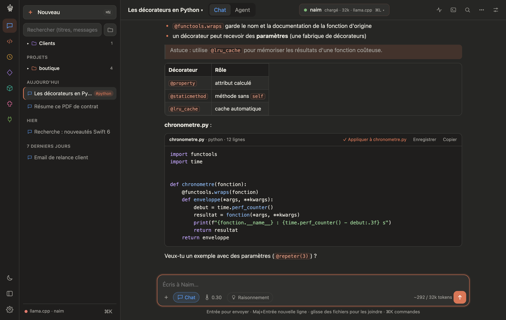 | 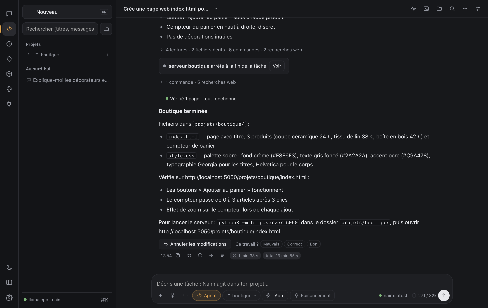 |
| **Chat** — réponses mises en forme, code avec « Appliquer au projet » | **Agent** — plan de travail, actions en direct, app lancée et vérifiée |
| 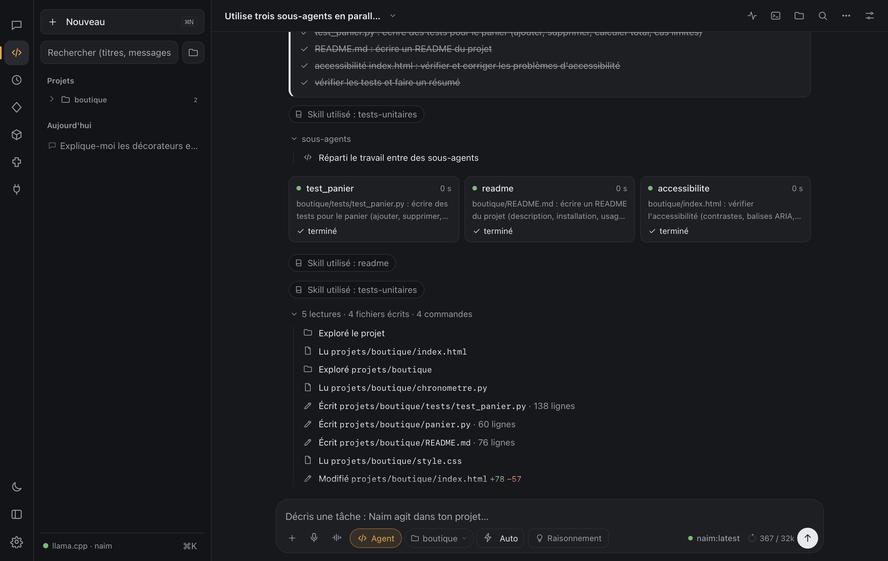 | 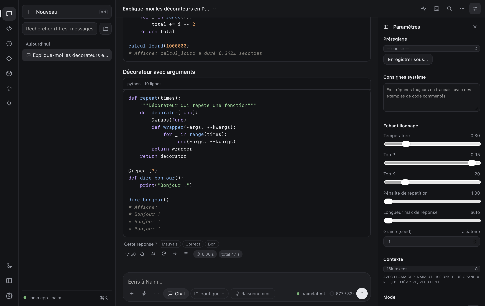 |
| **Sous-agents** — une grosse tâche répartie entre plusieurs agents | **Paramètres** — préréglages, consignes, échantillonnage, outils, notes |
| 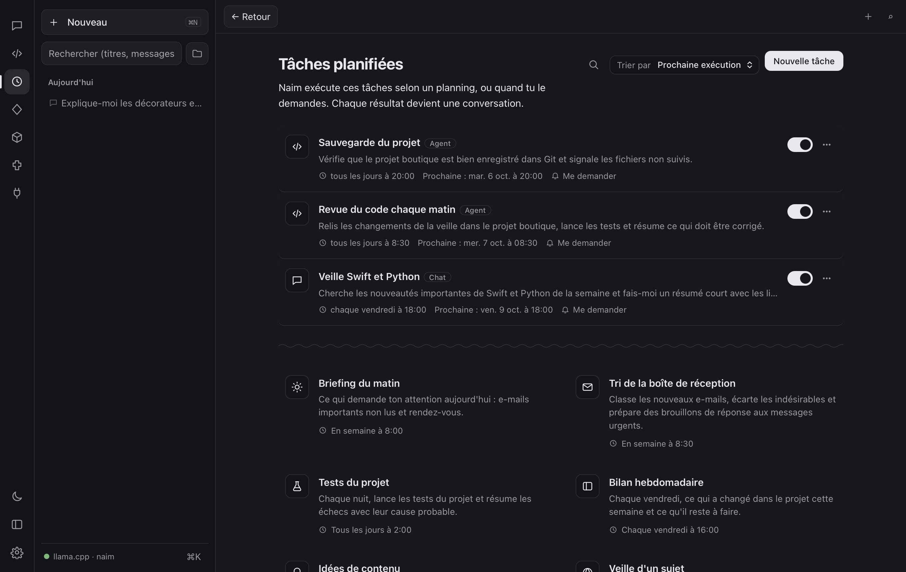 | 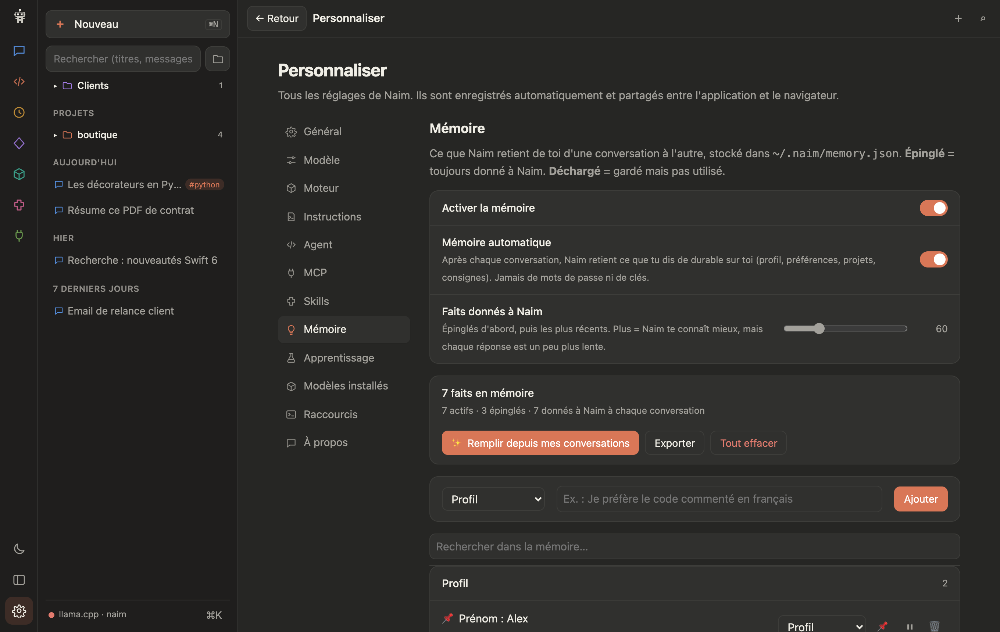 |
| **Planifier** — tâches automatiques avec règles d'autorisation | **Mémoire** — faits retenus, épinglés, déchargés |
| 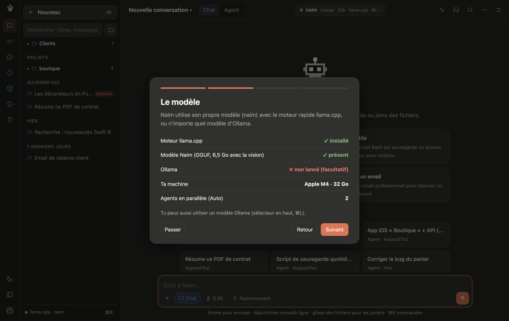 | 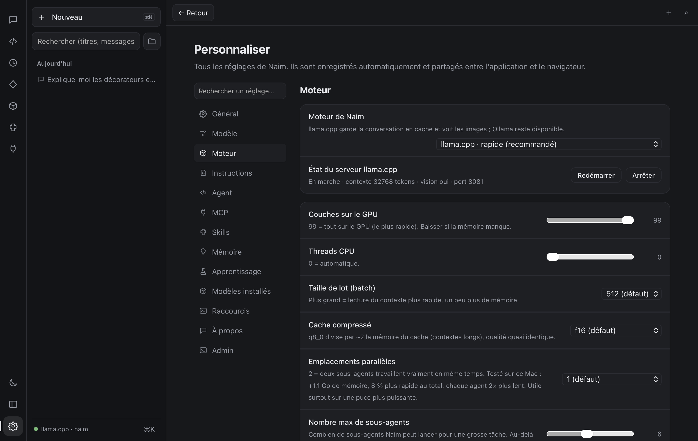 |
| **Premier lancement** — modèle, autorisations, apparence | **Moteur** — llama.cpp, agents en parallèle selon ta machine |
| 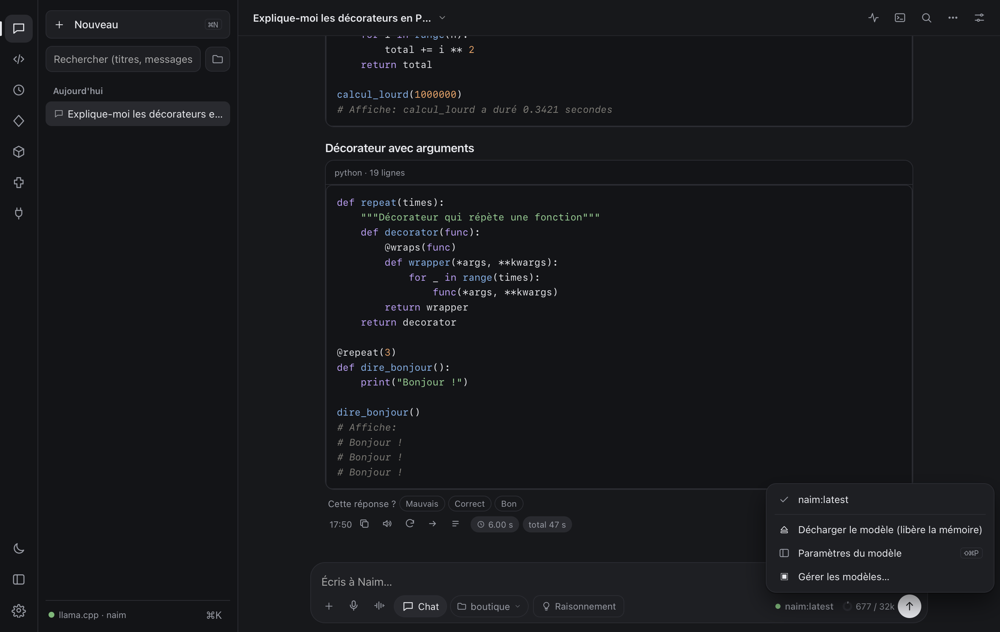 | 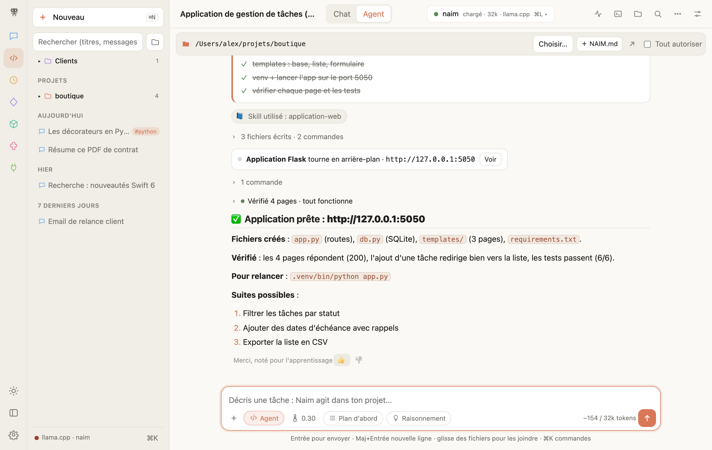 |
| **Modèles** — choix au centre (⌘L), déchargement en un clic | **Thème clair** — et 7 couleurs d'accent |

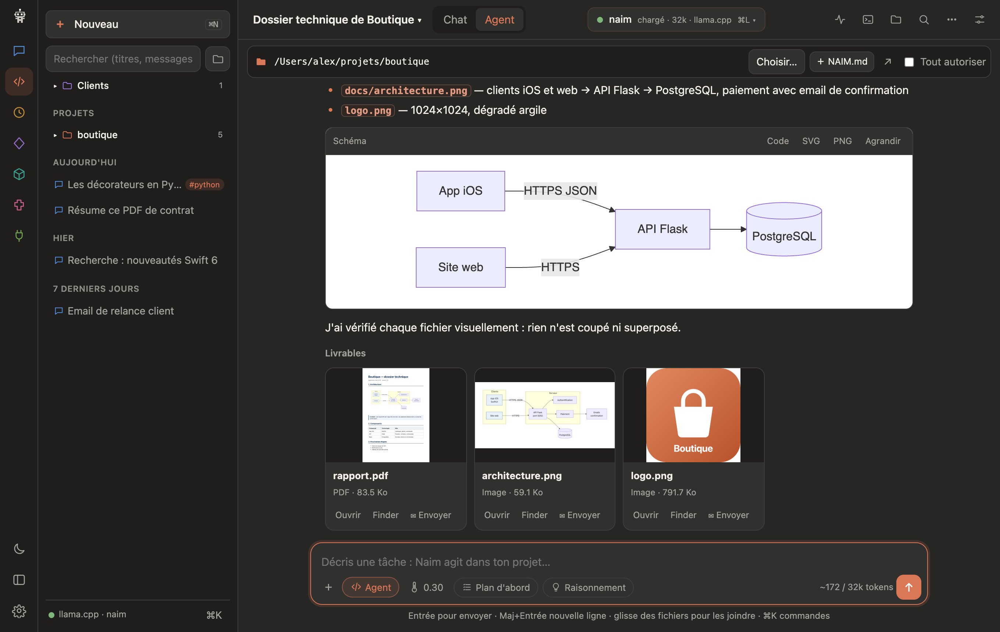

**Livrables** — un dossier technique en PDF avec son schéma d'architecture et un logo : le schéma est dessiné dans la
conversation, chaque fichier est vérifié visuellement puis présenté en carte (aperçu, Ouvrir, Finder, Envoyer).

Naim s'utilise aussi **dans le navigateur** (`naim --web`) : c'est la même interface que l'application.

## Le modèle Naim

Naim a **son propre modèle**, réservé à l'application Naim : il se télécharge automatiquement à l'installation
(ou depuis l'écran de bienvenue).

| | |
|---|---|
| Taille | ~9 milliards de paramètres |
| Architecture | **`naim`**, sa propre architecture : décodeur hybride de 32 couches, attention linéaire (Gated DeltaNet) avec une couche d'attention complète toutes les 4 |
| Détails | dimension 4096, 16 têtes d'attention (4 pour clés/valeurs), vocabulaire de 248 320 tokens |
| Contexte | jusqu'à 262 000 tokens (32 000 par défaut dans l'app) |
| Capacités | appel d'outils, mode raisonnement, vision (lecture d'images) |
| Téléchargement | 6,5 Go : le modèle (5,6 Go), sa vision (0,9 Go) et le moteur Naim (16 Mo), installés par l'application |
| Moteur | **moteur Naim** : une version de llama.cpp qui lit l'architecture `naim` (Metal, Apple Silicon) |
| Utilisation | dans Naim : l'application, le navigateur (`naim --web`) et le terminal (`naimtools`) |
| Vitesse (Mac M4, 32 Go) | ~12 à 17 tokens/s en écriture, ~75 à 100 tokens/s en lecture |
| Entraînement | affinage LoRA par auto-distillation, successeur de Mimo |
| Licence | Apache 2.0 |

Les fichiers du modèle portent son nom jusque dans leurs métadonnées (`general.architecture = naim`, vision
`naim_vision`) : ils s'ouvrent avec le moteur Naim, fourni avec l'application.

Chaque tâche réussie peut être gardée (sur ton Mac uniquement) pour entraîner la version suivante : Naim apprend de
ses propres réussites.

## Comment ça marche

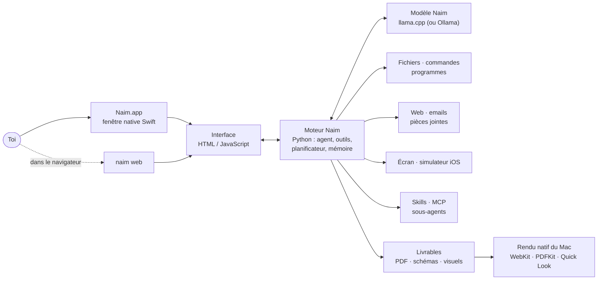
```mermaid
flowchart LR
  U([Toi]) --> APP["Naim.app<br/>fenêtre native Swift"]
  U -. dans le navigateur .-> WEB["naim web"]
  APP --> UI["Interface<br/>HTML / JavaScript"]
  WEB --> UI
  UI <--> ENG["Moteur Naim<br/>Python : agent, outils,<br/>planificateur, mémoire"]
  ENG <--> LLM["Modèle Naim<br/>llama.cpp (ou Ollama)"]
  ENG --> T1["Fichiers · commandes<br/>programmes"]
  ENG --> T2["Web · emails<br/>pièces jointes"]
  ENG --> T3["Écran · simulateur iOS"]
  ENG --> T4["Skills · MCP<br/>sous-agents"]
  ENG --> T5["Livrables<br/>PDF · schémas · visuels"]
  T5 --> RND["Rendu natif du Mac<br/>WebKit · PDFKit · Quick Look"]
```

**Une tâche en mode Agent** : Naim ne dit « terminé » qu'avec des preuves.

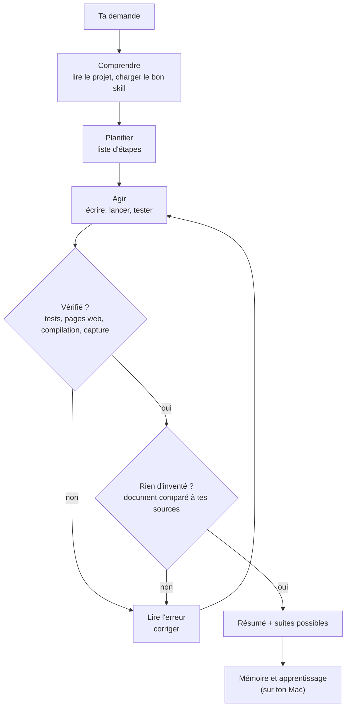
```mermaid
flowchart TD
  A["Ta demande"] --> B["Comprendre<br/>lire le projet, charger le bon skill"]
  B --> C["Planifier<br/>liste d'étapes"]
  C --> D["Agir<br/>écrire, lancer, tester"]
  D --> E{"Vérifié ?<br/>tests, pages web, compilation, capture"}
  E -- non --> F["Lire l'erreur<br/>corriger"] --> D
  E -- oui --> V{"Rien d'inventé ?<br/>document comparé à tes sources"}
  V -- non --> F
  V -- oui --> G["Résumé + suites possibles"]
  G --> H["Mémoire et apprentissage<br/>(sur ton Mac)"]
```

**Un livrable** (PDF, schéma, visuel) : Naim fabrique un vrai fichier, le regarde, corrige, puis te le présente.
Tout est rendu sur ton Mac, sans rien installer de plus (WebKit pour la mise en page, Mermaid gardé en local pour les
schémas).

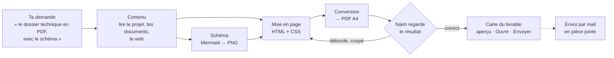
```mermaid
flowchart LR
  D["Ta demande<br/>« le dossier technique en PDF,<br/>avec le schéma »"] --> C["Contenu<br/>lire le projet, tes documents,<br/>le web"]
  C --> S["Schéma<br/>Mermaid → PNG"]
  C --> H["Mise en page<br/>HTML + CSS"]
  S --> H
  H --> P["Conversion<br/>→ PDF A4"]
  P --> L{"Naim regarde<br/>le résultat"}
  L -- "déborde, coupé" --> H
  L -- "correct" --> K["Carte du livrable<br/>aperçu · Ouvrir · Envoyer"]
  K -.-> M["Envoi par mail<br/>en pièce jointe"]
```

**Les sous-agents** : pour une grosse tâche, Naim découpe le travail et le confie à plusieurs agents qui ont les mêmes
outils. Le nombre d'agents qui travaillent vraiment en même temps s'adapte à ta machine (mode Auto : 1 à 6).

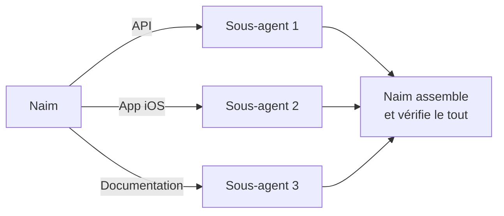
```mermaid
flowchart LR
  N["Naim"] -->|API| A1["Sous-agent 1"]
  N -->|App iOS| A2["Sous-agent 2"]
  N -->|Documentation| A3["Sous-agent 3"]
  A1 --> R["Naim assemble<br/>et vérifie le tout"]
  A2 --> R
  A3 --> R
```

## Naim face aux autres

| | **Naim** | LM Studio | Ollama | Assistants cloud<br/>(Cursor, Copilot…) |
|---|:---:|:---:|:---:|:---:|
| Fonctionne sans internet | ✅ | ✅ | ✅ | ❌ |
| Tes données restent sur ton Mac | ✅ | ✅ | ✅ | ❌ |
| Gratuit | ✅ | ✅ (usage personnel) | ✅ | abonnement |
| Open source | ✅ Apache 2.0 | ❌ | ✅ | ❌ (en général) |
| Agent qui crée, lance et vérifie tes projets | ✅ | ❌ | ❌ | ✅ |
| Apps iOS : compilation + simulateur | ✅ | ❌ | ❌ | selon l'outil |
| Tâches planifiées sur ton Mac | ✅ | ❌ | ❌ | selon l'outil |
| Emails : brouillons, tri, envoi | ✅ | ❌ | ❌ | via intégrations |
| Livrables vérifiés : PDF, schémas, visuels | ✅ | ❌ | ❌ | selon l'outil |
| Mémoire, skills, MCP, sous-agents | ✅ | MCP | ❌ | ✅ |
| Son propre modèle, prêt à l'emploi | ✅ | choix de modèles | choix de modèles | modèles de l'éditeur |

**En bref** : Naim réunit ce que les outils locaux font séparément (un modèle, une interface, un agent) et ajoute ce
qu'on trouve d'habitude seulement dans le cloud : un agent complet, des tâches automatiques, les emails, le simulateur
iOS — **gratuit, privé et hors ligne**. Les assistants cloud utilisent des modèles bien plus grands et restent plus
puissants sur les tâches très complexes ; Naim mise sur l'autonomie, la confidentialité et ton propre matériel.

## Performances face aux modèles de sa taille

Test réel, mêmes conditions pour tous (même Mac M4 32 Go, Ollama, température 0, mêmes consignes) — septembre 2026.

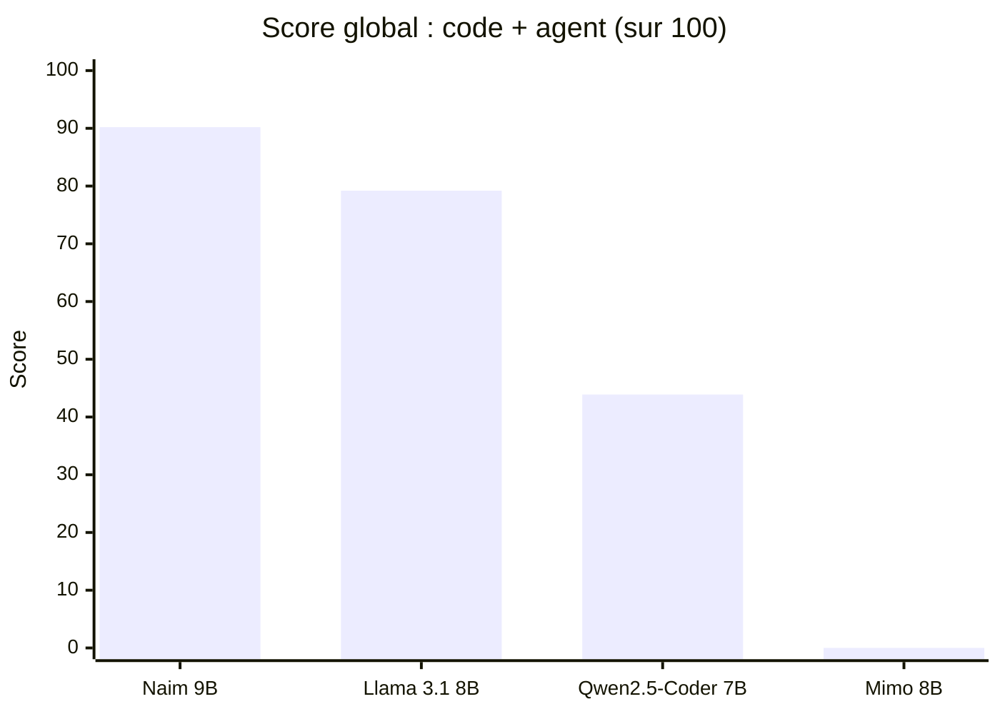
```mermaid
xychart-beta
  title "Score global : code + agent (sur 100)"
  x-axis ["Naim 9B", "Llama 3.1 8B", "Qwen2.5-Coder 7B", "Mimo 8B"]
  y-axis "Score" 0 --> 100
  bar [90.2, 79.2, 43.9, 0]
```

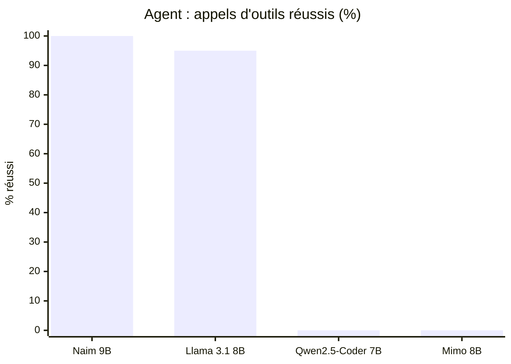
```mermaid
xychart-beta
  title "Agent : appels d'outils réussis (%)"
  x-axis ["Naim 9B", "Llama 3.1 8B", "Qwen2.5-Coder 7B", "Mimo 8B"]
  y-axis "% réussi" 0 --> 100
  bar [100, 95, 0, 0]
```

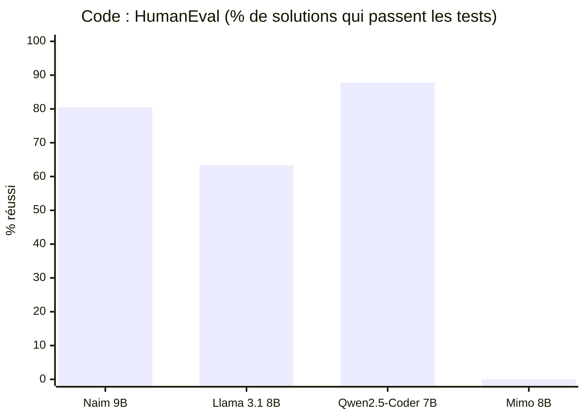
```mermaid
xychart-beta
  title "Code : HumanEval (% de solutions qui passent les tests)"
  x-axis ["Naim 9B", "Llama 3.1 8B", "Qwen2.5-Coder 7B", "Mimo 8B"]
  y-axis "% réussi" 0 --> 100
  bar [80.5, 63.4, 87.8, 0]
```

| Modèle | Taille | Code (HumanEval) | Agent (outils) | **Score global** |
|---|---|---|---|---|
| **Naim** | 9B | 33/41 — 80,5 % | **20/20 — 100 %** | **90,2** |
| Llama 3.1 | 8B | 26/41 — 63,4 % | 19/20 — 95 % | 79,2 |
| Qwen2.5-Coder | 7B | **36/41 — 87,8 %** | 0/20 — 0 % | 43,9 |
| Mimo (ancien modèle) | 8B | 0/41 — 0 % | non pris en charge | 0 |

**À retenir** : Naim est **le plus complet de sa catégorie** — c'est le seul à combiner un très bon niveau en code et un
agent qui ne se trompe jamais d'outil. Qwen2.5-Coder, spécialisé uniquement dans le code, fait un peu mieux en code
pur mais ne sait pas piloter d'outils (il écrit les appels en texte) : il ne peut pas servir d'agent.

**Méthode** (reproductible : [`tools/benchmark/bench.py`](tools/benchmark/bench.py), résultats bruts dans
[`results.json`](tools/benchmark/results.json)) :
- **Code** : 41 des 164 problèmes du test officiel [HumanEval](https://github.com/openai/human-eval) (un sur quatre) ;
  chaque solution est exécutée avec ses tests unitaires, elle ne compte que si tous passent.
- **Agent** : 20 tâches en français et en anglais (créer un fichier, lancer une commande ou un serveur, chercher sur
  le web, envoyer un email…) ; une réponse ne compte que si c'est le bon outil avec les bons paramètres.
- **Score global** : moyenne des deux pourcentages. Les modèles plus grands et les modèles cloud ne sont pas comparés
  ici : ils jouent dans une autre catégorie.

## Prérequis

- macOS sur **Mac Apple Silicon** (M1 ou plus récent), **16 Go** de mémoire conseillés
- Outils Xcode (`xcode-select --install`) — l'installeur te le propose
- [Homebrew](https://brew.sh) conseillé (outils de développement ; le moteur Naim est fourni avec le modèle)
- Environ **8 Go** d'espace disque (modèle de 6,5 Go)

## Installation

Une seule commande, dans le Terminal :

```bash
curl -fsSL https://raw.githubusercontent.com/nebios7/naim/main/install.sh | bash
```

L'installeur télécharge la dernière version de Naim, vérifie ton Mac, propose d'installer `llama.cpp` et de
télécharger le modèle depuis Hugging Face (sinon, l'écran de bienvenue de Naim le proposera). Ensuite, ouvre
**Naim** depuis le Launchpad ou Spotlight.

**Mettre à jour** : relance la même commande (tes conversations, réglages, skills et mémoire sont conservés).

<details>
<summary>Installer depuis les sources (développeurs)</summary>

```bash
git clone https://github.com/nebios7/naim.git
cd naim
bash install.sh
```

Mettre à jour : `git pull && bash install.sh`.
</details>

> Naim est une application **macOS** : il s'appuie sur des briques propres au Mac (WebKit, Vision, Mail,
> Simulateur iOS). Il n'existe pas de version Linux ni Windows.

## Premier lancement

Un écran de bienvenue en 4 étapes : le modèle (téléchargement si besoin), les autorisations macOS (facultatives :
écran, clics), l'apparence (thème, couleur, prénom). Tout se change ensuite dans **Personnaliser**.

Autorisations macOS (seulement si tu veux que Naim voie l'écran ou clique) : menu **Naim › Autoriser le contrôle de
l'écran…**, puis active « Naim » dans *Enregistrement de l'écran* et *Accessibilité*.

## Où sont tes données

| Dossier | Contenu |
|---|---|
| `~/Library/Application Support/Naim` | conversations, réglages, tâches planifiées |
| `~/.naim` | modèle, skills, mémoire, consignes `NAIM.md`, serveurs MCP |

Tout reste sur ton Mac. Naim n'utilise internet que pour les recherches web que tu lui demandes, les skills que tu
installes et les emails que tu l'autorises à envoyer.

## Confidentialité et partage des tâches (facultatif)

Par défaut, **rien ne quitte ton Mac**. Dans *Personnaliser › Apprentissage*, tu peux choisir de **partager les tâches
que tu as notées (Bon / Correct / Mauvais)** pour aider à entraîner la version suivante de Naim :

- **Seulement les tâches notées**, jamais tes autres conversations, ta mémoire ou tes consignes.
- **Nettoyées sur ton Mac avant l'envoi** : mots de passe, clés et tokens, emails, numéros de téléphone ou de carte,
  chemins personnels (`/Users/toi` → `~`). Le bouton « Voir ce qui sera envoyé » montre exactement ce qui part.
- **Anonymes** : un identifiant aléatoire d'installation, aucun nom ni email.
- **Supprimables** : le bouton « Supprimer mes données partagées » exclut définitivement tes tâches de tout
  entraînement. Tu peux aussi désactiver le partage à tout moment.
- Reçues par un [serveur de collecte](collecte/) (Cloudflare Workers) et stockées dans un dataset **privé** ; utilisées uniquement pour entraîner Naim.

Les notes ne sont jamais prises telles quelles : le [serveur de collecte](collecte/) et le
[tri avant entraînement](tools/curate_feedback.py) (code public) les comparent aux résultats réels de la tâche, écartent
les installations peu fiables, plafonnent la part de chaque installation et refusent tout contenu dangereux.

## Commandes

- `naim` — ouvre l'application
- `naim --web` — interface dans le navigateur
- `naimtools` — agent dans le terminal

## Licence

Apache 2.0 — voir [LICENSE](LICENSE). © 2026 ABDESSEMED Mohamed.
